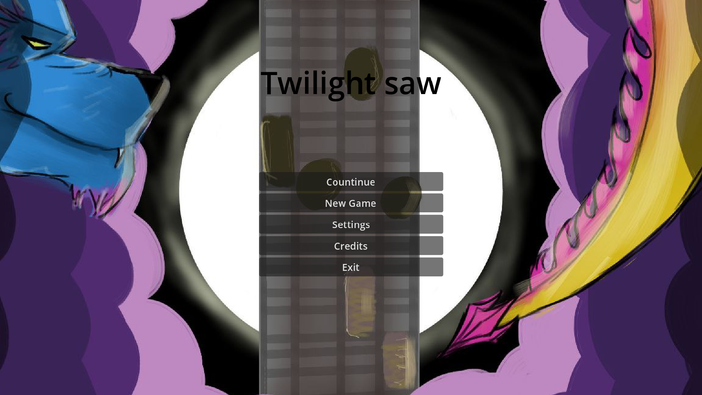

# Twilight Saw  
  
**Twilight Saw** - замороженный игровой прототип в жанре 2.5D tile-based combo clicker.  
Игрок управляет мини-пилой на производственном конвейере: нужно обрабатывать заготовки, расчищать отходы, зарабатывать очки и постепенно развивать производственную систему.  
  
Проект задумывался как смесь кликера, rhythm/osu-like взаимодействия и производственного гринда с элементами прокачки.  
  
  
  
    
  
    
  
## Идея Геймплея  
  
Основная идея проекта - сделать кликер, где игрок не просто нажимает одну кнопку, а взаимодействует с объектами на конвейере.  
  
Игровой процесс строится вокруг нескольких действий:  
  
- обработка объектов на производственной линии;  
- уничтожение или расчистка отходов;  
- получение очков за успешные действия;  
- поддержание темпа и комбо;  
- покупка улучшений;  
- постепенная автоматизация процесса.  
  
## Столбы проекта  
  
Проект изначально строился вокруг трёх дизайн-столпов:  
  
### Наполненность ивентами  
  
Игровое поле должно постоянно создавать небольшие события: появление объектов, отходов, бонусов, угроз или целей для реакции игрока.  
  
### Osu-like Interaction  
  
Взаимодействие планировалось сделать более активным, чем в обычном idle/clicker-жанре: игрок должен реагировать на объекты, выбирать цели и поддерживать ритм действий.  
  
### Прогрессия  
  
Игра должна была давать ощущение развития: больше очков, новые улучшения, автоматизация и расширение возможностей пилы.  
  
## Фичи  
  
В текущем прототипе присутствуют или были запланированы следующие элементы:  
  
- score system;  
- conveyor-based game field;  
- upgrade/shop screen;  
- repair and automation mechanics;  
- pause/menu interface;  
- tile-based interaction;  
- pixel-art visual style.  
  
## Было в планах  
  
Часть идей осталась на уровне концепта или ранней реализации:  
  
- полноценная система комбо;  
- несколько игровых режимов;  
- новелльные элементы;  
- развитие “бизнеса” и производственной цепочки;  
- расширенная автоматизация;  
- дополнительные персонажи или “друзья” мини-пилы;  
- более глубокая система улучшений.  
  
## Управление  
  
Управление в прототипе строилось вокруг прямого взаимодействия с объектами на экране.  
  
Планировались:  
  
- mouse/touch interaction;  
- tile-based targeting;  
- automation controls.  
  
## Art Style  
  
Проект использует пиксель-арт и контрастную ночную палитру: тёмный фон, луна, облака и производственная зона конвейера.  
  
Визуально игра должна была сочетать ощущение маленькой индустриальной системы и немного сказочной/сумеречной атмосферы.

## Статус проекта

Статус: **Замороженный прототип**.  
Разработка проекта была остановлена: часть механик осталась незавершённой, а изначальный соавтор прекратил участие в разработке.  
Тем не менее, проект сохранён как демонстрация раннего игрового прототипа, идеи механик и визуального направления.

## Как запустить
- Скачать exe из [Релиза](https://github.com/limbosmall/twilight-saw/releases/tag/v0.5)

## Разработано
[limbosmall](https://github.com/limbosmall) и [Zqurvk](https://github.com/Zqurvk)